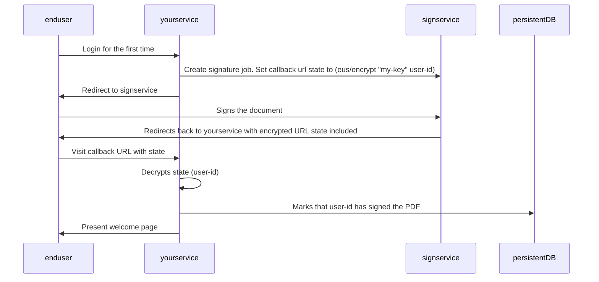

# encrypted-url-state

Encrypted url state. With expiration.

Ever wanted to store some encrypted state in a URL? Look no further.

## Rationale

Your service sends an end user to an external service for a task.
The external service supports custom callback URLs / URL parameters.

Your service does not want to
store unnecessary state, so it includes the state it needs to resume
work after the task is completed in the callback URL.

As the state is kept by the external service, a restart to your service will
not delete the state.

When your service is visited with the callback URL, it can decrypt
the state and then use it to resume doing whatever it needs to do.

For example in a signing process:



## Installation

```
com.github.ivarref/encrypted-url-state {:git/tag "v0.0.1" :git/sha "9aaf5de92e612393062769992353b2321ec38be7"}
```

## Usage

```clojure
(require '[com.github.ivarref.encrypted-url-state :as eus])

; Encrypt:
(eus/encrypt "my-key" "my-state") ; Default expiry: 3600 seconds (1 hour) from now
=> "TlBZDrDCzqg7goKQvpijViGM2_jEZEJqFk1Gcqibt5W64UzQLfYvbLnATi8TqUYuwg=="

; Explicit expiry given as epoch time in seconds: 24 hours from now
(eus/encrypt "my-key"
             (eus/curr-epoch-time-plus-seconds (* 24 3600))
             "my-state")
=> "TlBZDtz_UPYPEal6qmk-ACMUogigcP01wMZc_UWdg60fN6YHdmkrhfM9m7FH3wVlEw=="


; Decrypt:
; Default epoch time: (long (/ (System/currentTimeMillis) 1000))
(eus/decrypt "my-key" *1) 
=> {:expired? false, :state "my-state", :error? false, :error-message nil}

; Explicit epoch time:
(eus/decrypt "my-key"
             1746604368
             "TlBZDtz_UPYPEal6qmk-ACMUogigcP01wMZc_UWdg60fN6YHdmkrhfM9m7FH3wVlEw==") 
=> {:expired? false, :state "my-state", :error? false, :error-message nil}

; :error? will be true if a tamper attempt was detected:
; :error-message will be set to the message of the exception
(eus/decrypt "my-key" (eus/encrypt "attacker-key" "my-state"))
=> {:expired? false,
    :state nil, 
    :error? true,
    :error-message "Thaw failed. Possible decryption/decompression error, unfrozen/damaged data, etc."}

; :expired? will be true if the message was expired:
(eus/decrypt "my-key"
             (eus/curr-epoch-time-plus-seconds 3601) ; one second too old!
             (eus/encrypt "my-key" "my-state"))
=> {:expired? true, :state nil, :error? false, :error-message "Expired"}


; Full typical usage:
(let [input (eus/encrypt "my-key" "my-state")
      {:keys [error? expired? state]} (eus/decrypt "my-key" input)]
  (cond error?
        :call-the-cops ; state will be nil

        expired?
        :slow-user-alert ; state will be nil

        :else
        :do-work!))
```

### Details

`encrypt` and `decrypt` use high-strength AES128, courtesy of [nippy](https://github.com/taoensso/nippy/)*.
This yields a smaller amount of bytes than using a regular JWT would. An external user also cannot view
the contents of the state as the message is encrypted.
There is not any public key here. This means that the recipient of the encrypted state should be the same service
or another service with an identical private key/password.

### Thanks

* #clojure-norway on [Clojurians](https://clojurians.slack.com).
* \*[Peter Taoussanis](https://www.taoensso.com/) for nippy.
* \*[Magnar Sveen](https://magnars.com/) for [confair](https://github.com/magnars/confair).

### IFAQ

> Is it worth making a library consisting of only 58 lines of code?

Who knows.

> Why did you make it?

I went down a deep Java Standard Library signing/crypto rabbit hole, 
got feedback from #clojure-norway, felt the pain of the sunk cost fallacy,
deleted most of the code and ultimately just wrapped [nippy](https://github.com/taoensso/nippy/).

> IFAQ?

That is InFrequently Asked Questions.

## License

Copyright © 2025 Ivar Refsdal

Distributed under the Eclipse Public License either version 2.0 or (at
your option) any later version.